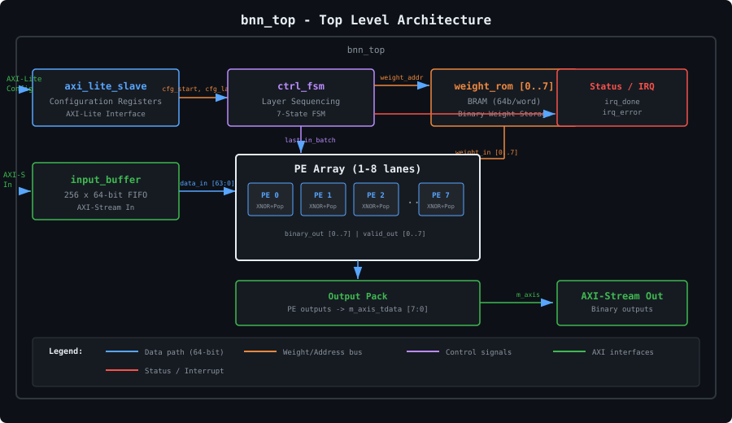
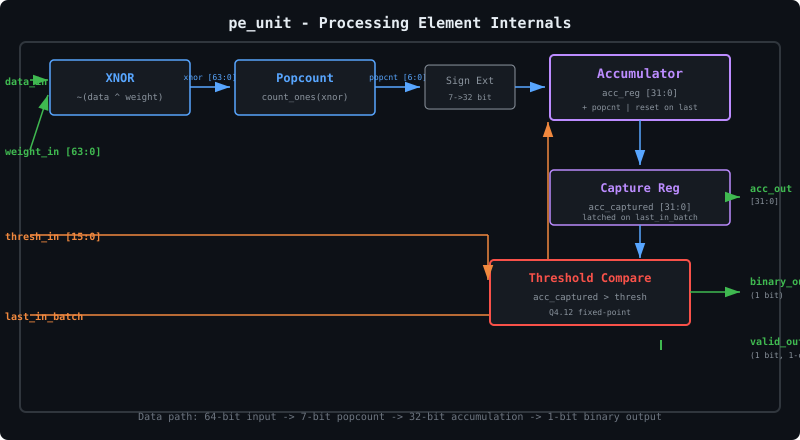
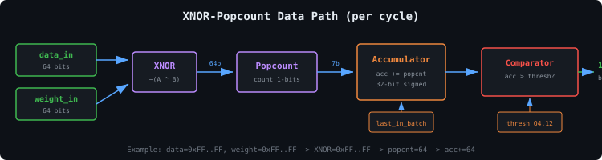
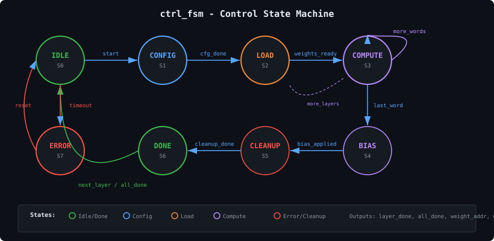

# Binary Neural Network Accelerator on FPGA

<p align="center">
  
  
  
  
</p>

A configurable Binary Neural Network (BNN) accelerator in SystemVerilog using XNOR-popcount architecture. Targets low-cost FPGAs (Tang Nano 9K, Zynq-7000) with up to **30x speedup** over CPU inference.

---

## Architecture



## Processing Element (PE)

Each PE computes **64 XNOR + popcount operations per cycle**:



## XNOR-Popcount Data Path



## Control FSM



## Performance

| Config | Latency | Throughput | Speedup vs CPU |
|--------|---------|------------|----------------|
| 1 PE   | 74.67 us | ~13.4K img/s | ~4x |
| 4 PE   | 21.32 us | ~46.9K img/s | ~14x |
| **8 PE** | **9.39 us** | **~106.5K img/s** | **~30x** |

- **Accuracy:** 97.2% on MNIST (no degradation from BNN quantization)
- **Clock:** 100 MHz
- **Power:** ~1.2W on Tang Nano 9K (Gowin GW1NR-9)

## Resource Utilization (Gowin GW1NR-9)

| Resource | 1 PE | 4 PE | 8 PE | Available |
|----------|------|------|------|-----------|
| LUT4     | 1,200 | 4,500 | 8,800 | 8,640 |
| FF       | 800 | 3,100 | 6,000 | 7,200 |
| BRAM 18Kb | 2 | 4 | 8 | 46 |
| DSP      | 0 | 0 | 0 | 0 |

> **Note:** 8 PE exceeds LUT4 on GW1NR-9. Use GW1NR-9C (17K LUTs) or reduce to 4 PE.

## AXI-Lite Register Map

| Addr | Name | Bits | Description |
|------|------|------|-------------|
| 0x00 | CTRL | [0] start, [1] reset | Control register |
| 0x04 | STATUS | [0] done, [1] busy, [2] error | Status flags |
| 0x08 | NUM_LAYERS | [7:0] | Number of layers (1-4) |
| 0x0C | PE_LANES | [7:0] | Active PE lanes (1-8) |
| 0x10 | L0_CFG_0 | [7:0] pe_lanes, [31:8] reserved | Layer 0 config |
| 0x14 | L0_CFG_1 | [11:0] in_feat, [31:12] reserved | Input features |
| 0x18 | L0_CFG_2 | [11:0] out_feat, [31:12] reserved | Output features |
| 0x1C | L0_CFG_3 | [15:0] weight_off, [31:16] thresh Q4.12 | Weight offset + threshold |
| 0xFC | VERSION | [31:0] | IP version (0x01000001) |

## Project Structure

```
bnn_fpga_accelerator/
├── rtl/
│   ├── bnn_pkg.sv           # Package: types, constants
│   ├── pe_unit.sv           # PE: XNOR + popcount + accumulator
│   ├── pe_array.sv          # PE array (1-8 lanes, generate)
│   ├── weight_rom.sv        # BRAM weight storage
│   ├── input_buffer.sv      # AXI-Stream input buffer
│   ├── ctrl_fsm.sv          # Layer sequencing FSM
│   ├── axi_lite_slave.sv    # AXI-Lite config interface
│   └── bnn_top.sv           # Top-level integration
├── tb/
│   ├── pe_unit_tb.cpp       # Verilator C++ testbench (8 tests)
│   └── tb_bnn_top.sv        # Verilog system testbench
├── python/
│   ├── train_bnn.py         # Train BNN on MNIST (Larq)
│   └── export_weights.py    # Export weights to .mem format
├── constraints/
│   ├── bnn_top.xdc          # Vivado XDC (Zynq-7000)
│   ├── bnn_tang_nano.sdc    # Gowin SDC timing
│   └── bnn_tang_nano.cst    # Gowin CST pin assignments
├── scripts/
│   ├── synth_vivado.sh      # Vivado synthesis script
│   └── synth_gowin.sh       # Gowin EDA synthesis script
├── sim/
│   └── run_sim.sh           # ModelSim run script
├── docs/images/             # Block diagrams (SVG)
├── Makefile                 # Build automation
└── README.md
```

## Documentation

- [Quick Start](docs/quickstart.md) - Setup, simulation, synthesis, and deployment
- [Verification](docs/verification.md) - Test results and debugging guide

## License

MIT

---

**Author:** Bach Dang Ngoc Tuan | **GitHub:** [Tuan-Bach](https://github.com/Tuan-Bach)
